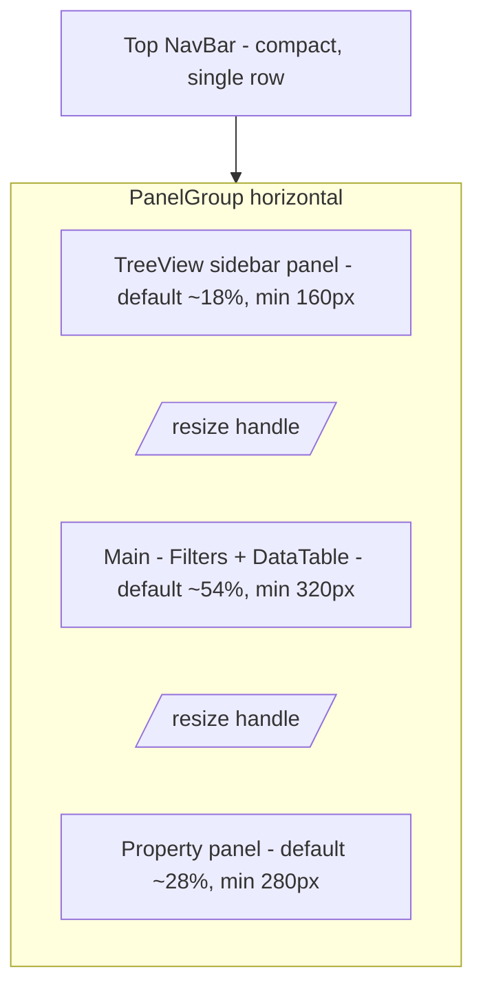

## Scope & approach

The shell lives in [vite/src/pages/main/index.tsx](vite/src/pages/main/index.tsx), which composes four regions inside a `react-grid-layout`:

- Top navbar: [vite/src/components/NavBar/index.tsx](vite/src/components/NavBar/index.tsx) (contains Preview / Commit / refresh + [vite/src/components/PathInput/index.tsx](vite/src/components/PathInput/index.tsx))
- Toolbar (filters + query bar): [vite/src/components/Filters/index.tsx](vite/src/components/Filters/index.tsx)
- Left column: [vite/src/components/TreeView/index.tsx](vite/src/components/TreeView/index.tsx) (+ [index.css](vite/src/components/TreeView/index.css))
- Middle column: [vite/src/pages/main/main.tsx](vite/src/pages/main/main.tsx) (`DataTable` + `Filters`)
- Right column: [vite/src/components/Property/index.tsx](vite/src/components/Property/index.tsx)

Tokens/colors come from [vite/src/styles/globals.css](vite/src/styles/globals.css) and [vite/tailwind.config.js](vite/tailwind.config.js); there is already a `card` / `background` / `muted` / `accent` / `border` design-token system in place. The revamp standardizes everything onto those tokens.

The work splits cleanly into 4 independent areas, which will be parallelized across subagents.

### Layout change: splitter

Replace `react-grid-layout` in [vite/src/pages/main/index.tsx](vite/src/pages/main/index.tsx) with [`react-resizable-panels`](https://github.com/bvaughn/react-resizable-panels) (a tiny, well-maintained splitter lib, React 17 compatible). Vertical layout:



- Persist panel sizes via `autoSaveId="refi-main-layout"` so they survive reloads.
- Handles are 1px lines using `bg-border`, with a 4px invisible hit area and a `hover:bg-primary/30` state.
- Drop `AutoSizer` (no longer needed) and drop the `BASE_HEIGHT`/`BASE_SPACE` math.

### Navbar + pathbar

In [vite/src/components/NavBar/index.tsx](vite/src/components/NavBar/index.tsx):

- Reduce row height: container becomes `h-10 px-3 gap-2 bg-background border-b border-border` (currently the nav lives inside an RGL cell at `BASE_HEIGHT=32` but renders `h-10 sm` shadcn buttons which overflow; use `size="sm"` with `h-8` via `className`, and make the refresh icon `size="icon"` with `h-8 w-8`).
- Remove the `w-px h-full` divider hack and just rely on `gap`.

In [vite/src/components/PathInput/index.tsx](vite/src/components/PathInput/index.tsx):

- Fix the breadcrumb: the current rendering does not interleave separators and drops the final segment visually. Rewrite `PathViewer` to render all entities (including the final one as an `Anchor` or bold `Span`) with a `/` separator between each, e.g.:

```tsx
{
  allEntities.map((entity, i) => (
    <React.Fragment key={`${entity}-${i}`}>
      {i > 0 && <Span className="px-1 text-muted-foreground">/</Span>}
      {i === allEntities.length - 1 ? (
        <Span className="font-medium text-foreground">{entity}</Span>
      ) : (
        <Anchor onClick={(e) => handleClickEntity(e, entity)}>{entity}</Anchor>
      )}
    </React.Fragment>
  ));
}
```

- Replace the outer `bg-gray-200 dark:bg-gray-900` with `bg-card border border-border rounded-md h-8 px-2`, matching the rest of the UI's card surfaces.
- Make the edit-mode `<Input>` inherit the same `bg-card` so toggling modes doesn't flash a different color.

### Toolbar padding

In [vite/src/components/Filters/index.tsx](vite/src/components/Filters/index.tsx):

- Wrap the whole component in a toolbar container: `px-3 py-2 bg-card border-b border-border`.
- Bump spacing between groups: outer flex uses `gap-3`, left group uses `gap-2`, right group uses `gap-3`.
- Normalize button sizes: all use zendesk `size="small"` already, add consistent horizontal padding (`px-3`).
- Normalize doc count / pagination: wrap in a `px-2` container so it doesn't hug the "New document" button.

### Color consistency (sidebar + column chrome)

- In [vite/src/components/TreeView/index.tsx](vite/src/components/TreeView/index.tsx):
  - Replace sidebar header `bg-gray-200 dark:bg-gray-900 border-b-2 border-gray-400` with `bg-card border-b border-border` and match the tree body `bg-card` (currently `dark:bg-gray-900`).
  - Search input: replace `dark:bg-gray-900` with `bg-background border-border`.
  - Node hover classes: swap `hover:bg-gray-200 dark:hover:bg-gray-800` for `hover:bg-accent`.
- In [vite/src/components/TreeView/index.css](vite/src/components/TreeView/index.css):
  - Change `.rc-tree-treenode-selected` from hard-coded gray-300/gray-800 to `@apply bg-accent text-accent-foreground`.
- Wrap each of the 3 panels in a shared shell: `rounded-md border border-border bg-card overflow-hidden` (applied in [vite/src/pages/main/index.tsx](vite/src/pages/main/index.tsx) around each panel's content).

### Left column horizontal scrolling

The CSS already sets `overflow-x: auto` on `.rc-tree-list-holder > div`, but the parent tree wrapper uses `AutoSizer disableWidth` inside a `flex flex-col h-full` which clips. Fix:

- In [vite/src/components/TreeView/index.tsx](vite/src/components/TreeView/index.tsx), remove `AutoSizer` (we already know height via the flex parent) OR add `min-w-0` + `overflow-x-auto` to the wrapping div, and drop the `width` constraint from `rc-tree`.
- Add `white-space: nowrap` to `.rc-tree-treenode` content so long collection/document IDs extend and scroll rather than wrap.
- Ensure the parent panel (in `index.tsx`) does NOT set `overflow-hidden` on the inner content area that contains the tree body.

### Out of scope (this pass)

Data table styling, property table styling, modal styles, and the top window-chrome tabs in [vite/src/pages/Tabs.tsx](vite/src/pages/Tabs.tsx) are left untouched. We will iterate on these in pass 2.

## Parallel delegation

Four subagents will run in parallel, each owning one slice. All four will merge cleanly because they touch different files (with one shared file, `pages/main/index.tsx`, which is owned end-to-end by Agent A):

- Agent A - Layout: add `react-resizable-panels` to [vite/package.json](vite/package.json), rewrite [vite/src/pages/main/index.tsx](vite/src/pages/main/index.tsx) to a horizontal `PanelGroup` with two resize handles and remove RGL usage.
- Agent B - NavBar + PathInput: shrink navbar height, fix breadcrumb rendering, move to `bg-card` in [vite/src/components/NavBar/index.tsx](vite/src/components/NavBar/index.tsx) and [vite/src/components/PathInput/index.tsx](vite/src/components/PathInput/index.tsx).
- Agent C - Toolbar: add padding/spacing and card container to [vite/src/components/Filters/index.tsx](vite/src/components/Filters/index.tsx).
- Agent D - Sidebar colors + horizontal scroll: update [vite/src/components/TreeView/index.tsx](vite/src/components/TreeView/index.tsx) and [vite/src/components/TreeView/index.css](vite/src/components/TreeView/index.css).

## Verification

- Build: `npm --prefix vite run build` must succeed.
- Visual: dark mode looks uniformly like the `--card` surface; the pathbar shows `projectId / collection / ...` with separators and the final segment visible; toolbar has breathing room; middle and right panels can be dragged to resize and sizes persist across reloads; long tree items scroll horizontally within the left column without wrapping.
