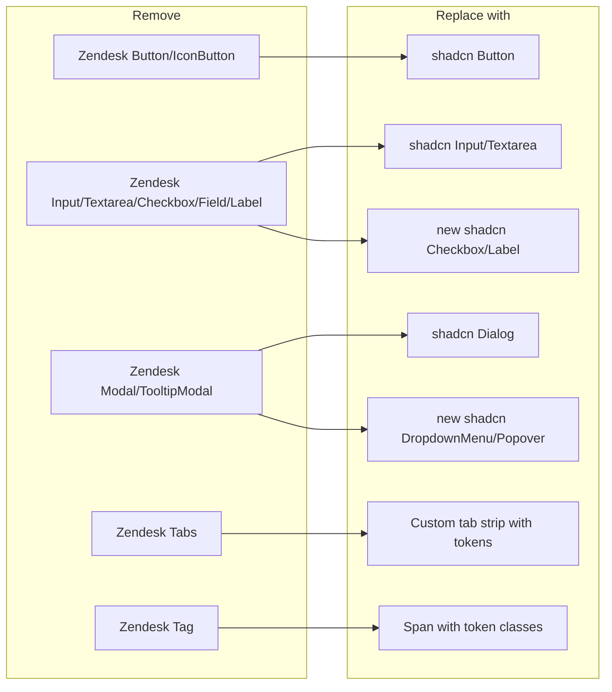

## Goals

- Zero `bg-gray-*` / `bg-blue-*` / `bg-red-*` / `bg-green-*` / `bg-yellow-*` / `bg-white` / `dark:bg-gray-*` literals in any user-facing component under `vite/src`.
- Zero `@zendeskgarden/react-buttons`, `@zendeskgarden/react-forms`, `@zendeskgarden/react-modals`, `@zendeskgarden/react-tabs`, `@zendeskgarden/react-tags` imports in user-facing components (keep `@zendeskgarden/react-theming` / `@zendeskgarden/react-breadcrumbs` / `@zendeskgarden/react-tooltips` until a pass 3 if still needed).
- New semantic CSS variables for dirty-row / new-row / highlight-flash / deleted states, consumed as `bg-status-changed`, `bg-status-new`, `bg-status-highlight`, `bg-status-deleted` tailwind colors.

## New infrastructure

### Status tokens

Add to [vite/src/styles/globals.css](vite/src/styles/globals.css) under both `:root` and `.dark`:

```css
/* light */
--status-changed: 217 91% 60% / 0.14; /* primary-tinted */
--status-new: 158 74% 45% / 0.18; /* emerald-tinted */
--status-highlight: 45 96% 60% / 0.24; /* amber-tinted, for flash */
--status-deleted: 0 72% 55% / 0.18; /* destructive-tinted */

/* dark */
--status-changed: 217 91% 60% / 0.22;
--status-new: 158 74% 45% / 0.26;
--status-highlight: 45 96% 60% / 0.3;
--status-deleted: 0 72% 55% / 0.28;
```

Register in [vite/tailwind.config.js](vite/tailwind.config.js) under `extend.colors`:

```js
status: {
  changed: "hsl(var(--status-changed))",
  new: "hsl(var(--status-new))",
  highlight: "hsl(var(--status-highlight))",
  deleted: "hsl(var(--status-deleted))",
},
```

Then `bg-status-changed`, `bg-status-new`, etc. are available everywhere.

### New shadcn primitives (add under [vite/src/components/ui/](vite/src/components/ui))

- `checkbox.tsx` - wraps `@radix-ui/react-checkbox` (already installed).
- `label.tsx` - trivial `<label>` with token classes.
- `dropdown-menu.tsx` - wraps a new dep `@radix-ui/react-dropdown-menu` for the Filters query-split button and the existing `DropdownMenu` component's internal menu.
- `popover.tsx` - wraps a new dep `@radix-ui/react-popover` for TooltipModal replacement (Commander-menu-like popovers).
- `select.tsx` - optional; used by `SelectComboBox` rewrite. Alternative: keep the existing combo box logic and just restyle its list popover.

New deps: `@radix-ui/react-dropdown-menu@^2`, `@radix-ui/react-popover@^1` (both React 17 compatible via peer dep range, `--legacy-peer-deps` on install).

## Architecture of the migration



## Work slices (parallel subagents)

All slices depend on the infrastructure setup (status tokens + new primitives), which must complete first. Then 5 slices run in parallel. One final integration + build.

### Slice 0 - Infrastructure (sequential, first)

Owner: single agent.

- Add status tokens to [vite/src/styles/globals.css](vite/src/styles/globals.css) and [vite/tailwind.config.js](vite/tailwind.config.js).
- Install `@radix-ui/react-dropdown-menu`, `@radix-ui/react-popover` via `npm install --legacy-peer-deps` in the `vite` directory.
- Create [vite/src/components/ui/checkbox.tsx](vite/src/components/ui/checkbox.tsx), [label.tsx](vite/src/components/ui/label.tsx), [dropdown-menu.tsx](vite/src/components/ui/dropdown-menu.tsx), [popover.tsx](vite/src/components/ui/popover.tsx), following shadcn canonical templates.
- Add a `Badge`-like inline status chip helper or just document the pattern `inline-flex items-center rounded px-2 py-0.5 text-xs bg-status-new text-foreground` for the tag replacement.

### Slice A - DataTable + EditableCell family

Owner: agent A.

Files:

- [vite/src/components/DataTable/index.tsx](vite/src/components/DataTable/index.tsx)
- [vite/src/components/EditableCell/index.tsx](vite/src/components/EditableCell/index.tsx)
- [vite/src/components/EditableCell/EditablePropertyField.tsx](vite/src/components/EditableCell/EditablePropertyField.tsx)
- [vite/src/components/EditableCell/EditablePropertyValue.tsx](vite/src/components/EditableCell/EditablePropertyValue.tsx)

Changes:

- Remove dead `import { Cell } from "@zendeskgarden/react-tables"` in `DataTable/index.tsx:38`.
- Token migration on every hard-coded color cited in the exploration: header/row borders -> `border-border`, hover -> `hover:bg-accent`, text -> `text-foreground` / `text-muted-foreground`.
- In `EditableCell/index.tsx`: replace `Checkbox`, `Field`, `Label`, `Textarea` from zendesk with shadcn Checkbox/Label/Textarea; replace `Tooltip` from `@zendeskgarden/react-tooltips` with shadcn Tooltip.
- Dirty-state mapping: `bg-blue-200` / `dark:bg-gray-500` -> `bg-status-changed`; `bg-green-200` -> `bg-status-new`; `bg-yellow-200` -> `bg-status-highlight`; `bg-red-300` -> `bg-status-changed` (red was also a "changed" indicator - unify).
- Focus rings: `focus:ring-blue-400` -> `focus:ring-ring`; `focus:bg-blue-100` -> `focus:bg-accent`.
- Active-row ID border: `border-blue-400` -> `border-primary`.
- `CopyIcon bg-white` -> `bg-card`.
- Keep react-table + react-window virtualization - no structural change.

### Slice B - Property panel

Owner: agent B.

Files:

- [vite/src/components/Property/index.tsx](vite/src/components/Property/index.tsx)
- [vite/src/components/Property/PropertyTable.tsx](vite/src/components/Property/PropertyTable.tsx)
- [vite/src/components/Property/MonacoProperty.tsx](vite/src/components/Property/MonacoProperty.tsx)

Changes:

- `_id` label cell: `text-gray-700 dark:text-gray-200` -> `text-foreground`, `border-gray-200 dark:border-gray-700` -> `border-border`, `border-gray-300 dark:border-gray-500` -> `border-primary` when `doc.isNew`.
- `_id` input: `disabled:text-gray-700 disabled:border-gray-200 dark:border-gray-700 dark:text-white` -> `disabled:text-muted-foreground disabled:border-border text-foreground`.
- `CopyIcon` `bg-white` -> `bg-card`.
- Help-link anchor `text-blue-500` -> `text-primary`; tooltip inline `code` `text-red-700 bg-gray-100` -> `text-destructive bg-muted`; `dark:text-gray-200` -> `text-foreground`.
- PropertyTable cells: `border-gray-300` -> `border-border`; add row hover `hover:bg-accent/40` on `<tr>`.
- "Add property" button (`PropertyTable.tsx:157-177`): convert raw `<button>` to shadcn `Button variant="outline" size="sm"`; `text-green-500` icon -> `text-muted-foreground`.
- MonacoProperty wrapper border: `border-gray-300 dark:border-gray-700` -> `border-border`.
- MonacoPropertyError `text-red-700` -> `text-destructive`; borders -> `border-border`.
- Remove unused `import { useTheme } from "styled-components"` if present.
- Clean up the commented basic/advantage toggle block (delete the dead code - already commented, now obsolete).

### Slice C - Filters + FilterItem + combo boxes + data inputs

Owner: agent C.

Files:

- [vite/src/components/Filters/index.tsx](vite/src/components/Filters/index.tsx)
- [vite/src/components/Filters/FilterItem.tsx](vite/src/components/Filters/FilterItem.tsx)
- [vite/src/components/InputComboBox/index.tsx](vite/src/components/InputComboBox/index.tsx)
- [vite/src/components/SelectComboBox/index.tsx](vite/src/components/SelectComboBox/index.tsx)
- [vite/src/components/DataInput/index.tsx](vite/src/components/DataInput/index.tsx)
- [vite/src/components/DataInput/ArrayInput.tsx](vite/src/components/DataInput/ArrayInput.tsx)
- [vite/src/components/DataInput/ObjectInput.tsx](vite/src/components/DataInput/ObjectInput.tsx)
- [vite/src/components/DataInput/BooleanInput.tsx](vite/src/components/DataInput/BooleanInput.tsx)
- [vite/src/components/DataInput/DateTimePicker.tsx](vite/src/components/DataInput/DateTimePicker.tsx) (+ [DateTimePicker.css](vite/src/components/DataInput/DateTimePicker.css))
- [vite/src/components/DataInput/GeopointPicker.tsx](vite/src/components/DataInput/GeopointPicker.tsx)

Changes:

- `Filters/index.tsx`: swap all `Button` from `@zendeskgarden/react-buttons` to shadcn `Button`. Map: `size="small"` -> `size="sm"`; `isPrimary` -> `variant="default"`; `isBasic` -> `variant="ghost"`. Dropdown chevron becomes shadcn `DropdownMenu` with a `Button size="icon"` trigger. Remove `bg-blue-100` (Properties active) -> `data-[state=open]:bg-accent` or a boolean `className="bg-accent"`. `text-gray-300` disabled state -> `disabled:text-muted-foreground`. `dark:text-gray-200` -> `text-foreground`. `dark:bg-gray-50` on DropdownMenu container -> `bg-popover`.
- `FilterItem.tsx`: swap `Input` from `@zendeskgarden/react-forms` to shadcn `Input` (all `isCompact` -> `className="h-7 text-sm"`). Swap `Button` + `IconButton` to shadcn `Button` (`variant="outline" size="sm"` for "Add item"; `variant="ghost" size="icon"` for active-toggle and trash). `text-red-700 hover:bg-white hover:border hover:border-gray-300` (type dropdown trigger) -> `text-destructive hover:bg-accent hover:border-border`. `border-gray-300` (timestamp wrappers) -> `border-border`. `text-gray-400`/`text-gray-500` -> `text-muted-foreground`.
- `InputComboBox/index.tsx` + `SelectComboBox/index.tsx`: replace Zendesk `Input` with shadcn `Input`; dropdown list `bg-white border-gray-300` -> `bg-popover border-border`; highlighted row `bg-blue-200` -> `bg-accent text-accent-foreground`; chevron `text-gray-500` -> `text-muted-foreground`.
- `DataInput/index.tsx`: replace Zendesk `Textarea` with shadcn `Textarea` (already exists under [ui/textarea.tsx](vite/src/components/ui/textarea.tsx)); `focus:bg-blue-100 dark:focus:bg-gray-900` -> `focus:bg-accent`.
- `DataInput/ArrayInput.tsx` + `ObjectInput.tsx`: `bg-white border-gray-300 text-green-500` -> `bg-card border-border text-muted-foreground`.
- `DataInput/BooleanInput.tsx`: replace Zendesk `Checkbox`/`Field`/`Label` with shadcn `Checkbox` + `Label`.
- `DataInput/DateTimePicker.tsx` input: `focus:bg-blue-100 dark:text-gray-200 focus:ring-red-400 focus:ring-blue-400` -> `focus:bg-accent text-foreground focus:ring-ring`.
- `DateTimePicker.css`: replace `@apply border-gray-300` -> `@apply border-border`; `@apply bg-blue-500` (selected date) -> `@apply bg-primary`; any `#fff` backgrounds -> `hsl(var(--popover))`.
- `GeopointPicker.tsx`: `border-gray-400 focus:bg-blue-100` -> `border-border focus:bg-accent`.

### Slice D - Modals + notifier + dropdown menu

Owner: agent D.

Files:

- [vite/src/pages/background/PreviewChanges.tsx](vite/src/pages/background/PreviewChanges.tsx)
- [vite/src/pages/background/Commander.tsx](vite/src/pages/background/Commander.tsx)
- [vite/src/pages/background/DocFinder.tsx](vite/src/pages/background/DocFinder.tsx)
- [vite/src/components/ImportModal/index.tsx](vite/src/components/ImportModal/index.tsx)
- [vite/src/components/DropdownMenu/index.tsx](vite/src/components/DropdownMenu/index.tsx)
- [vite/src/components/Notifier/index.tsx](vite/src/components/Notifier/index.tsx)

Changes:

- `PreviewChanges.tsx`: replace Zendesk `Modal`/`Header`/`Footer`/`FooterItem`/`ModalBody` with shadcn `Dialog`/`DialogContent`/`DialogHeader`/`DialogTitle`/`DialogFooter`. Replace Zendesk `Button` with shadcn `Button`. Replace Zendesk `Tag` with inline `<span>` using status tokens: changed -> `bg-status-changed`, new -> `bg-status-new`, deleted -> `bg-status-deleted`. `text-white bg-red-400` close button -> shadcn Dialog's built-in close. `hover:bg-gray-200` row hover -> `hover:bg-accent`. `text-blue-500` link -> `text-primary`.
- `Commander.tsx`: replace Zendesk `Modal`/`ModalBody` with shadcn `Dialog`/`DialogContent` (command palette sized: `max-w-lg p-0`). Replace Zendesk `Input` with shadcn `Input`. `CommandOption` list rows: `text-gray-700 hover:bg-gray-200 hover:text-gray-900 bg-gray-200` (active) -> `text-foreground hover:bg-accent data-[active=true]:bg-accent`. Remove the stale `useFocusJail` import.
- `DocFinder.tsx`: same modal pattern as Commander; list-row color mapping identical.
- `ImportModal/index.tsx`: already uses shadcn `Dialog`. Swap Zendesk `Input`/`Checkbox`/`Field`/`FileUpload`/`Label`/`Message` for shadcn `Input`/`Checkbox`/`Label` and a simple `<input type="file">` styled with shadcn wrappers. Validation `Message` -> a small `<p className="text-sm text-destructive">`.
- `DropdownMenu/index.tsx`: replace Zendesk `TooltipModal` with shadcn `DropdownMenu` (the new radix primitive). `text-gray-700 bg-gray-200` active-item -> `data-[highlighted]:bg-accent text-foreground`. Keep the same external API (`menu` prop, `placement`, `containerClassName`) so call sites in `Filters` and elsewhere don't need refactoring.
- `Notifier/index.tsx`: keep Zendesk notifications for this pass (explicitly out of scope - toasts are a separate migration) OR wrap them in a token-consistent container. Default: leave alone; note in plan that this is deferred.

### Slice E - Window-chrome Tabs

Owner: agent E.

Files:

- [vite/src/pages/Tabs.tsx](vite/src/pages/Tabs.tsx)

Changes:

- Remove Zendesk `Tabs`/`TabList`/`Tab` - replace with a small custom tab strip (plain `<div>` + `<button>` elements) since the behavior is limited: click to select, middle click or X to close, plus-tab to add. The existing state (`tabList`, `selectedTab`, `window.api.*` calls) stays untouched.
- Per-tab pill styling using tokens: base `flex items-center gap-2 px-4 py-1.5 text-sm border-r border-border text-muted-foreground hover:bg-accent hover:text-foreground cursor-pointer`; active tab adds `bg-card text-foreground`.
- Close icon: `opacity-0 group-hover:opacity-100` preserved, swap to a lucide `X` icon since `lucide-react` is already a dep, styled `text-muted-foreground hover:text-foreground`.
- Add-tab button: use lucide `Plus` icon, `px-3 py-1.5 text-muted-foreground hover:bg-accent hover:text-foreground`.
- Windows controls: close button `hover:bg-red-600` -> `hover:bg-destructive hover:text-destructive-foreground`. The raster icon `img srcSet` stays (it's OS-chrome).

### Slice F - Integration + cleanup

Owner: a final single agent after slices 0-E merge.

- Remove any now-unused Zendesk imports from remaining files.
- Run `npm --prefix vite run build` and fix any TypeScript / lint regressions.
- Audit with `rg "bg-gray-|bg-blue-|bg-red-|bg-green-|bg-yellow-|bg-white\b|dark:bg-gray-" vite/src` and report remaining hits. Goal: zero hits in user-facing `.tsx` files; CSS files under `vite/src` that still use gray-scale should be restricted to third-party vendor CSS patches.
- Grep for remaining `@zendeskgarden/react-buttons|react-forms|react-modals|react-tabs|react-tags` imports and verify only `react-theming` / `react-tooltips` / `react-breadcrumbs` / `react-notifications` remain (by design - those are deferred).

## Verification

- `npm --prefix vite run build` exits 0.
- Visual smoke in dark mode: DataTable rows have border-border, hover accent, dirty cells use the new status tokens; PropertyTable matches; Preview changes modal uses shadcn Dialog chrome; Commander/DocFinder command palettes are centered with shadcn Dialog; Filters toolbar buttons look identical-family to navbar buttons; window-chrome tabs have clean active/hover states.
- Shortcut keys (`Cmd+K` opens Commander, `Cmd+P` opens DocFinder, Preview/Commit hotkeys) still work since Recoil wiring + hotkeys weren't touched.
- FilterItem still validates and Recoil-drives through `actionAddFilter`/`actionSubmitQuery` identically.

## Out of scope (pass 3)

- `@zendeskgarden/react-notifications` (`Notifier`) -> swap to shadcn Sonner or custom toast portal.
- `@zendeskgarden/react-breadcrumbs` (no usages after pass 1).
- `@zendeskgarden/react-tooltips` residuals in `EditablePropertyValue` (swap when we rewrite the value-type overlay).
- Monaco theme colors (currently defined in [vite/src/config.tsx](vite/src/config.tsx) `defineTheme`) - align with tokens.
- DataTable deleted-row visual (there isn't one today; would add a `bg-status-deleted` row when `isDeleted`).

## Delegation summary

- Slice 0 runs sequentially FIRST (all other slices depend on the new tokens + primitives).
- Slices A, B, C, D, E then run in parallel (5 subagents).
- Slice F integrates sequentially after all merge.
- One shared file risk: `Filters/index.tsx` (Slice C) references `DropdownMenu` component (rewritten by Slice D). Slice D will keep the same public API so Slice C doesn't need to know.
